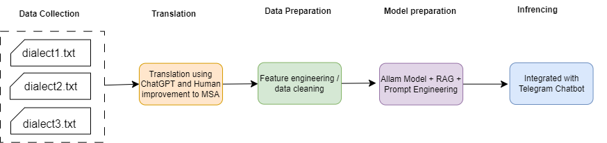

# Translation Chatbot with RAG and Telegram Integration

This repository contains a set of scripts and notebooks to build a translation chatbot, leveraging Retrieval-Augmented Generation (RAG) and prompt engineering techniques. The chatbot provides translations between Standard Arabic and regional dialects and is deployable on Heroku via the provided deployment structure.

## Table of Contents

- [Overview](#overview)
- [Project Structure](#project-structure)
  - [bot_translation.ipynb](#bot_translationipynb)
  - [bot_translation_telegram.ipynb](#bot_translation_telegramipynb)
  - [data preparation.ipynb](#data-preparationipynb)
  - [rag & prompt eng](#rag--prompt-eng)
  - [deployment.zip](#deploymentzip)
  - [embedding_generator.ipynb](#embedding_generatoripynb)
- [Getting Started](#getting-started)
- [Deployment](#deployment)

## Overview

This project features a Telegram chatbot capable of translating between Standard Arabic and various dialects. The chatbot is designed with the following components:

- **Data**: Data we collected from different ressources.
- **RAG and Prompt Engineering**: Integrates RAG to enhance translation accuracy by retrieving similar texts and fine-tuning prompt engineering techniques.
- **Model Inference**: Uses `bot_translation.ipynb` to load and perform inference on our translation model.
- **Telegram API Integration**: Deploys as a Telegram bot with automated responses.
- **Deployment**: A Heroku-compatible deployment structure for hosting the chatbot.


## Project Structure

### `data preparation.ipynb`

This notebook prepares the dataset required for the translation model. It collects text data, translates it, and labels each entry with its dialect type to create a final JSON format suitable for training and inference.

#### Key Sections:
- **Data Collection**: Gathers and preprocesses source text data.
- **Translation and Labeling**: Translates text to Standard Arabic and assigns dialect type labels.
- **JSON Formatting**: Structures the data for easy ingestion by the model.

### `bot_translation.ipynb`

This notebook demonstrates how to load and perform inference on the translation model. It includes the steps for loading pre-trained weights, preparing input data, and running inference to obtain translation outputs.

#### Key Sections:
- **Model Loading**: Loads a pre-trained model optimized for translating Arabic dialects.
- **Inference Function**: Defines the function to pass text input and receive translated output.

### `rag & prompt eng`

This notebook applies RAG to the collected data, generating embeddings and refining prompt engineering for effective model output. The RAG approach enables the model to draw upon a database of example translations to improve accuracy.

#### Key Sections:
- **Embedding Calculation**: Generates embeddings for each text entry in the dataset.
- **Prompt Engineering**: Refines prompt formats to guide the model in generating responses that include translations and dialect classifications.

### `bot_translation_telegram.ipynb`

This notebook integrates the model with the Telegram API, utilizing RAG and prompt engineering for enhanced responses. The chatbot performs dialect detection and translation, serving as a conversational tool on Telegram.

#### Key Sections:
- **Telegram Bot API Setup**: Sets up the bot using Telegram’s API for communication.
- **Model Integration**: Combines RAG techniques with the ALLAM model (what we did in inference notebook ).
- **Prompt Engineering**: Optimizes prompts for accurate translation and dialect detection.


### `deployment.zip`

This archive contains the deployment structure necessary for hosting the app on Heroku. It includes configurations, necessary files, and instructions for deploying the chatbot on a cloud platform.

#### Key Sections:
- **Deployment Configurations**: Provides `Procfile`, environment configurations, and any required dependencies.
- **Hosting Platform Integration**: Details Heroku deployment steps, such as adding necessary buildpacks and managing environment variables.

### `embedding_generator.ipynb`

This notebook is dedicated to generating embeddings for the text data, useful for similarity matching within the RAG framework. These embeddings support improved context-based translations in the chatbot.

## Getting Started

1. Clone this repository:
   ```bash
   git clone https://github.com/BouchetaSana/allam_aec
   cd allam-aec

2. **Install necessary dependencies:**
   ```bash
   pip install -r requirements.txt
   ```

3. **Set up environment variables** for the Telegram bot, including the `TELEGRAM_TOKEN`, and configure any additional credentials required for deployment.

4. **Run the notebooks in the following sequence:**
   - `data preparation.ipynb`
   - `embedding_generator.ipynb`
   - `rag & prompt eng`
   - `bot_translation.ipynb` (for standalone inference)
   - `bot_translation_telegram.ipynb` (for the Telegram bot integration)

## Deployment

To deploy this chatbot on Heroku:

1. **Extract `deployment.zip`** and move its contents to your project root.
2. **Ensure all dependencies are correctly listed** in `requirements.txt`.
3. **Create a new Heroku app** and set up environment variables.
4. **Deploy to Heroku using Git:**
   ```bash
   git add .
   git commit -m "Initial commit"
   git push heroku main
   ```
```
